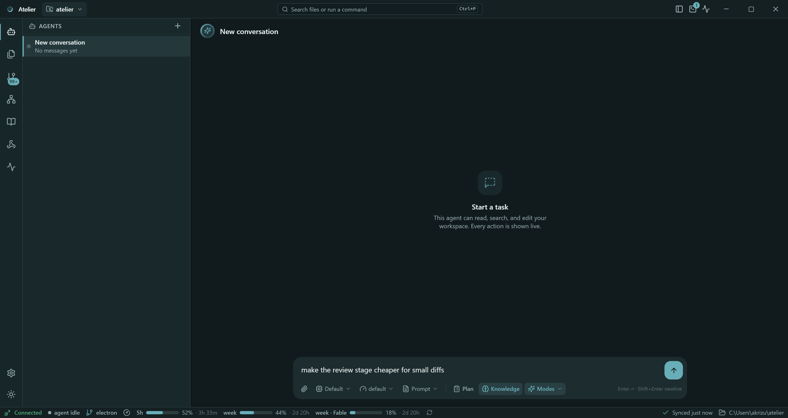
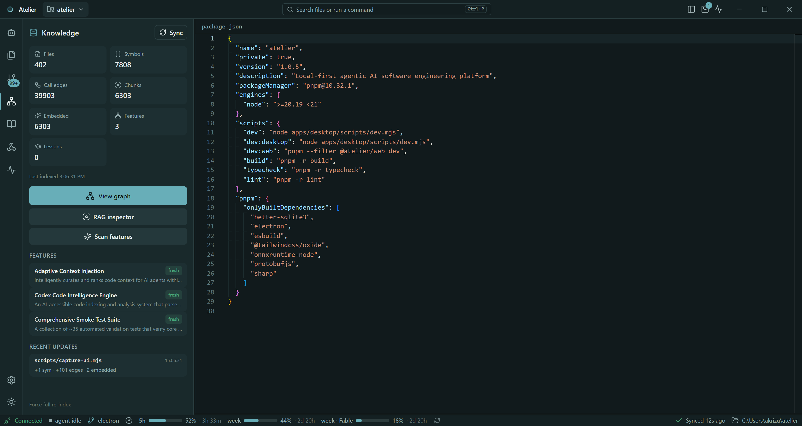
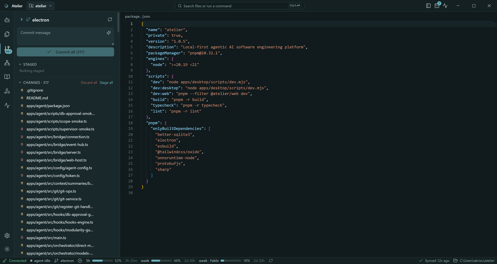
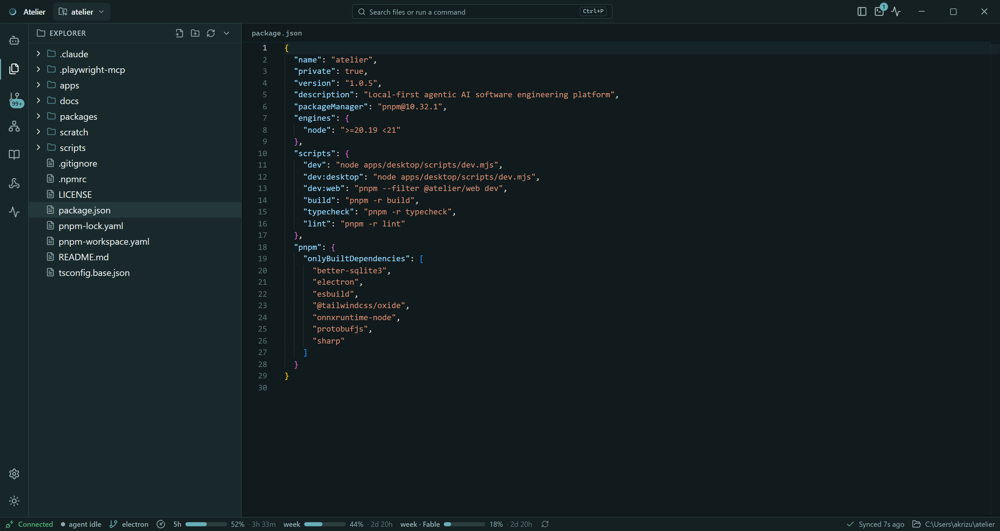
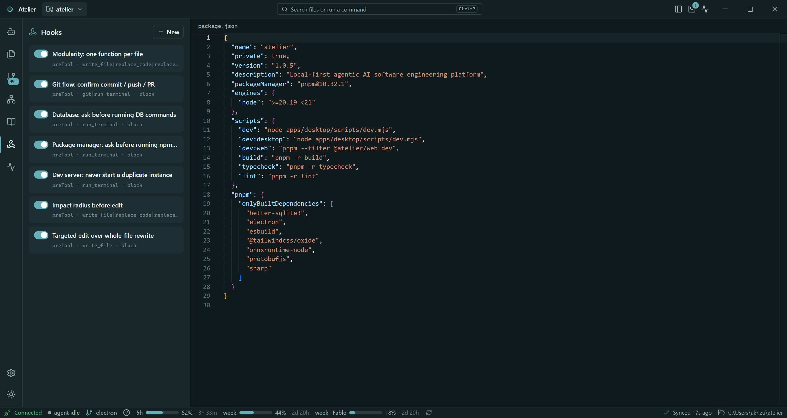

# Atelier

**Your workshop for building software with agents.** Atelier is a
local-first, agentic software-engineering IDE that runs as a native desktop
app: your code, your index, your terminal and your git history never leave
the machine.

[](LICENSE)


[**Landing page**](https://lamji.github.io/atelier/) · [Download](#download)
· [The console](#the-console) · [Features](#features)
· [Run it locally](#run-it-locally) · [Releasing](#releasing)
· [FAQ — how it works and what it stores](FAQ.md)

Open a folder and Atelier parses it with tree-sitter into a local SQLite
symbol graph and vector store, then runs agent sessions against that index
through a staged pipeline with hooks that stop the destructive things
*before* they happen. Chat, editor, diffs, terminal, source control and the
knowledge graph are one console, not seven windows.

> **Alpha, and honest about it.** Windows is the platform it is developed and
> packaged on; the code is cross-platform but macOS/Linux are unverified and
> the installer script is NSIS-only.

## Download

Windows only for now (see the note above). The installer is
`Atelier-Setup.exe` on the
[latest release](https://github.com/lamji/atelier/releases/latest).

### From the command line

`Atelier-Setup.exe` has no version in its name on purpose, so this URL keeps
working across releases:

```powershell
cd $env:USERPROFILE\Downloads
curl.exe -fL https://github.com/lamji/atelier/releases/latest/download/Atelier-Setup.exe -o Atelier-Setup.exe
.\Atelier-Setup.exe
```

> **`curl.exe`, not `curl`.** In Windows PowerShell `curl` is an alias for
> `Invoke-WebRequest`, which does not understand `-L` or `-o` — the plain
> version of this line fails there. In **cmd.exe** and **Git Bash**, `curl`
> is the real binary and works as written. `-f` makes curl fail on an HTTP
> error instead of saving the error page as a 270 MB-shaped `.exe`.

Without curl at all:

```powershell
Invoke-WebRequest -Uri https://github.com/lamji/atelier/releases/latest/download/Atelier-Setup.exe -OutFile Atelier-Setup.exe
```

A specific version, rather than the newest:

```powershell
curl.exe -fL https://github.com/lamji/atelier/releases/download/v1.0.0/Atelier-Setup-1.0.0.exe -o Atelier-Setup-1.0.0.exe
```

Every release also carries `Atelier-Setup-<version>.exe` — the same bytes
under a name that stays meaningful once it is sitting in a downloads folder.

### Verify what you downloaded

Each release publishes a `SHA256SUMS.txt` and repeats the hash in its notes:

```powershell
curl.exe -fL https://github.com/lamji/atelier/releases/latest/download/SHA256SUMS.txt -o SHA256SUMS.txt
(Get-FileHash Atelier-Setup.exe -Algorithm SHA256).Hash
Get-Content SHA256SUMS.txt
```

The two should match, case aside — `Get-FileHash` returns uppercase.

Download, verify and run in one go, refusing to launch on a mismatch:

```powershell
cd $env:USERPROFILE\Downloads
curl.exe -fL https://github.com/lamji/atelier/releases/latest/download/Atelier-Setup.exe -o Atelier-Setup.exe
curl.exe -fL https://github.com/lamji/atelier/releases/latest/download/SHA256SUMS.txt -o SHA256SUMS.txt
$want = (Select-String -Path SHA256SUMS.txt -Pattern 'Atelier-Setup\.exe').Line.Split(' ')[0]
$got  = (Get-FileHash Atelier-Setup.exe -Algorithm SHA256).Hash.ToLower()
if ($got -eq $want) { .\Atelier-Setup.exe } else { Write-Warning "hash mismatch" }
```

> **Releases up to v1.0.2 are not code-signed**, so Windows SmartScreen says
> *"Windows protected your PC — unknown publisher"* for them: choose
> **More info** → **Run anyway**. The hash above proves the file was not
> altered in transit; it does not remove that dialog, because SmartScreen
> asks who signed the code rather than whether the bytes match. Later
> releases are signed — `npm run release` refuses to build without a signing
> credential and refuses to publish an installer Windows does not report as
> validly signed. Each release's notes say which kind of build it is, and a
> signed one can be checked yourself:
>
> ```powershell
> Get-AuthenticodeSignature Atelier-Setup.exe | Format-List Status, SignerCertificate
> ```
>
> See [`docs/code-signing.md`](docs/code-signing.md).

### What the installer does

It is a normal wizard — welcome, install location, then a **Required tools**
page that reports what Atelier needs from your machine:

| Tool | Why | If missing |
|---|---|---|
| **git** | the agent runs it directly for status, diff, commit, merges and the push wizard | offered, ticked by default |
| **Node.js** | for the projects you open — npm installs, dev servers, tests. Atelier itself ships its own | offered, ticked by default |
| **Codex CLI** | optional provider | reported only |
| **Ollama** | optional provider | reported only |

Ticked tools are installed with **winget** during the install, with its
output printed in the progress log. Untick anything you would rather handle
yourself; the install continues either way. Where winget is unavailable the
page reports what is missing and installs nothing.

Atelier installs per-user, so no administrator prompt — except from winget
itself, if it needs one for a package.

## The console



| | |
|---|---|
|  |  |
| Knowledge — graph counts and the features it inferred | Source control — changes, staging, the commit wizard |
|  |  |
| Explorer and the Monaco editor | Hooks — the guards and what they match |

Every image above is a real capture of the app running against this
repository, regenerated with `node scripts/capture-ui.mjs` (see
[`docs/assets/`](docs/assets)). More of them, plus the light theme, are on the
[landing page](https://lamji.github.io/atelier/).

- **Left rail** — Agents, Explorer, Source Control, Knowledge, Notes, Hooks,
  Monitor; Settings and the light/dark toggle pinned at the bottom. Badges
  show working agents and changed files.
- **Sidebar** — whichever rail destination is selected.
- **Main area** — the editor region's own tab bar swaps between chat, open
  files and diffs; the title bar keeps the workspace switcher, the command
  center and the terminal/activity toggles. Agent file edits render inline in
  the transcript as VS Code-style diffs.
- **Bottom dock** — real terminal sessions; **status bar** — agent connection
  and state, branch, plan usage, context tokens, knowledge sync progress and
  the open workspace.

## Features

**Agents and models**

- Many concurrent agent sessions per project, and many projects open at once —
  each project gets its own agent process, so one keeps working while you look
  at another.
- Providers: **Claude** (Agent SDK, via your Claude Code sign-in), **Codex
  CLI**, and **Ollama** (local daemon or Ollama Cloud). Settings has a
  per-provider switch plus a
  model allowlist; the composer's picker is assembled from exactly those.
- Per-turn controls: model, reasoning effort, plan mode, vibe rules. `@` to
  reference files, `/` for commands and prompt files, paste a screenshot to
  attach it.

**The pipeline**

Ten observable stages — `understand → retrieve → impact → plan → hooks →
execute → validate → knowledge → review → summary` — streamed to the process
rail as they run. Trivial chat skips the whole thing instead of paying for it.

**Knowledge engine (entirely local)**

- tree-sitter (wasm) indexer into SQLite: files, symbols, imports/exports,
  call edges, features, chunks.
- Embeddings computed on-device (`Xenova/all-MiniLM-L6-v2` via
  `@huggingface/transformers`) into a `sqlite-vec` store — no embedding API.
- Symbol graph, impact analyzer, clone scan, companion files, plus *lessons*
  the agent writes and reads back on later turns.
- Exposed as tools: `retrieve_knowledge`, `query_knowledge_graph`,
  `search_symbols`, `search_workspace`, `impact_of_edit`, `analyze_impact`,
  `save_lesson`.

**Guardrails that actually block**

Every tool call — whether invoked by the model or the UI — runs through one
registry with a scope guard and a hook gate, and emits `tool.*` events, so
nothing bypasses observability.

- **Impact guard** — the first edit to an existing source file is refused
  until the agent has called `impact_of_edit` on it.
- **Rewrite guard** — targeted edits over whole-file rewrites.
- **Git flow guard** — the agent cannot commit, push or open a PR; it raises a
  request you confirm in a wizard.
- **DB approval**, **dev-server** and **package-command** guards — privileged
  commands pause in an approval modal instead of running silently.
- **Scope guard** — a conversation stays inside the files it was scoped to.
- **Validation runners** — lint, typecheck and test as first-class stages.

**Workbench**

Monaco editor and diff viewer, file explorer, markdown/notes panel, command
palette, ConPTY terminal sessions (`@lydell/node-pty`) shared with the agent's
`run_terminal` tool, source control with a commit → push → PR wizard (`gh`),
a connect-a-remote flow for repos without an origin, RAG inspector, hooks
panel, multi-session monitor, dark/light themes.

**Context engineering**

Token ledger, per-request budgets, dedup, candidate ranking, prompt caching,
task summaries, shared session context, tool-output trimming and a live usage
monitor — the context assembled for each request is accounted for and visible.

**MCP and skills**

The agent ships its toolset as an MCP server (that is how the Codex provider
gets the same tools), loads workspace skills, and has a Settings tab for
external MCP servers and user rules.

## How it fits together

- **`apps/desktop`** — the Electron app. Main process owns the project registry
  and a ProjectManager that forks one agent **utilityProcess** per open project.
- **`apps/agent`** — the Local Agent runtime. Owns every privileged
  operation: Claude Agent SDK, filesystem, terminal, git, tree-sitter
  knowledge engine, RAG, hooks, validation. Serves RPCs over an Electron
  MessagePort (no sockets, no tokens).
- **`apps/web`** — the renderer (React + Vite). Workspace picker → workspace;
  a pure presentation layer that talks to its agent through a
  transferred MessagePort.
- **`packages/protocol`** — the zod-typed contract (RPC methods, event
  taxonomy, native port frames) all sides compile against.

## Run it locally

### 1. Prerequisites

- **Node 20 LTS** — pinned via `engines`, 21+ is rejected (`node -v`)
- **pnpm 10** — `corepack enable` is enough, the version is pinned in
  `packageManager`
- **git**, and optionally the **GitHub CLI (`gh`)** for the PR wizard
- At least one model provider, or no agent turn can run:
  - **Claude** — a Claude subscription signed in through Claude Code
    (`claude` → `/login`), or
  - **Codex CLI** signed in, or
  - **Ollama** — a local daemon with a model pulled (`127.0.0.1:11434`, or
    your `OLLAMA_HOST`), and/or an **Ollama Cloud** API key
- No Visual Studio build tools needed — the native modules
  (`better-sqlite3`, `@lydell/node-pty`) ship prebuilt

### 2. Clone and install

```sh
git clone https://github.com/lamji/atelier.git
cd atelier
corepack enable          # provides the pinned pnpm 10
pnpm install
```

### 3. Start the dev stack

```sh
pnpm dev
```

One command (`apps/desktop/scripts/dev.mjs`), four things:

1. retargets `better-sqlite3` to the **Electron ABI** — the agent runs as a
   utilityProcess on Electron's Node, not on system Node. A marker file keyed
   by Electron version means only the first run (or an Electron bump) pays it.
2. renders the app icon — `build/` is gitignored, so a fresh clone has none.
3. starts esbuild watchers for desktop main/preload and the agent bundle, plus
   Vite on the first port free on *both* IPv4 and IPv6, scanning from 5173.
4. launches the Electron window once Vite answers.

Renderer edits hot-reload. Main/preload rebuilds restart the window on their
own; agent rebuilds are picked up the next time a project starts. Closing the
window tears the whole stack down, as does `Ctrl+C` in the terminal.

### 5. First run inside the app

Pick a folder in the workspace picker and let the first index finish —
tree-sitter parses the repo into SQLite and embeddings are computed on-device,
so a large repo takes a minute of CPU. Then open **Settings → Providers**,
switch on at least one provider and allow the models you want; the composer's
picker is exactly that union. Every open project gets its own agent process,
so one keeps working while you look at another.

### Dev environment variables

| Variable | Effect |
| --- | --- |
| `ATELIER_WEB_PORT` | Pin the Vite port instead of scanning from 5173 |
| `OLLAMA_HOST` | Point the local Ollama provider at a non-default endpoint |

### If it does not start

- **`better-sqlite3` prebuild failed** — a previous dev stack still has the
  `.node` file open. Stop it and rerun `pnpm dev`.
- **`ERR_PNPM_UNSUPPORTED_ENGINE` on install** — you are on Node 21+; Atelier
  pins Node 20 LTS.
- **Window opens but no models in the picker** — no provider is switched on,
  or the CLI it probes is not signed in. Settings → Providers → Test re-probes.

## Configuration

### Providers

Nothing is configured in a file — open **Settings → Providers** in the app:

- **Claude** — no key to enter; the roster is probed from your signed-in
  Claude Code CLI. The Test button re-probes it.
- **Codex** — same, through the Codex CLI.
- **Ollama** — two endpoints, local and Ollama Cloud. The local roster is read
  live, so an `ollama pull` shows up without restarting the agent; the cloud
  one takes an API key from `ollama.com/settings/keys`, stored locally and
  never sent back to the UI.

Each provider has an on/off switch plus a per-model allowlist; the composer's
model picker is exactly the union of what is switched on. Credentials and the
workspace database live under your local app-data directory, never in the repo.

## Packaging (Windows)

```sh
pnpm --filter @atelier/desktop dist   # NSIS installer -> apps/desktop/release/
```

`build-backend.mjs` stages the web dist + agent bundle + natives
retargeted to the Electron ABI under `resources/`. No system Node needed.
The installer's dependency page lives in
[`apps/desktop/installer/deps.nsh`](apps/desktop/installer/deps.nsh).

## Releasing

One command does the whole thing:

```sh
npm run release              # 1.0.0 -> 1.0.1
npm run release -- minor     # 1.0.0 -> 1.1.0
npm run release -- major     # 1.0.0 -> 2.0.0
npm run release -- 1.2.3     # exactly this version
```

It runs these steps, in order:

1. **Preflight** — refuses early if the tag already exists, `gh` is not
   signed in, or there is no signing credential, so a twelve-minute build
   never gets thrown away at the end. A dirty working tree is a warning, not
   a stop: what ships is your working tree, and it says so.
2. **Bump** `apps/desktop/package.json` — the one place the version lives.
   electron-builder names the artifact from it and the git tag follows it,
   so the three can never disagree.
3. **Build** the NSIS installer, signed.
4. **Hash** it, copy it to the version-less `Atelier-Setup.exe`, and check
   the signature Windows sees on it — anything other than `Valid` stops the
   release here, with the build on disk and nothing tagged.
5. **Commit** `Release <version>`, **tag** `v<version>`, push both.
6. **Publish** the GitHub release with the installer, the stable copy and
   `SHA256SUMS.txt`, with notes generated from the commits since the last
   tag.

Rehearse it first — this changes nothing at all:

```sh
npm run release -- --dry-run
```

Build and tag without publishing (upload by hand later):

```sh
npm run release -- --no-publish
```

**Signing.** Every release is signed. The credential comes from the
environment — Azure Trusted Signing (`AZURE_SIGN_ENDPOINT`,
`AZURE_SIGN_ACCOUNT`, `AZURE_SIGN_PROFILE` plus the Entra ID service
principal), or a certificate file in `CSC_LINK` + `CSC_KEY_PASSWORD` — and
the script checks it twice: it refuses to start the build without one, and
after the build it asks Windows whether the installer is really signed
(`Get-AuthenticodeSignature` must say `Valid`), stopping before the commit,
tag and upload if it is not. The signer's name then goes into the release
notes. `--allow-unsigned` is the deliberate, loud exception. See
[`docs/code-signing.md`](docs/code-signing.md).

**If the upload fails** after the build succeeded, the tag is already pushed
and the artifact is on disk — the script prints the exact `gh release create`
line to retry with.

**What users get.** `Atelier-Setup.exe` on `/releases/latest/download/` keeps
its URL forever, which is what makes the `curl` line in
[Download](#download) work; the versioned copy and the checksums sit beside
it.

## Layout

```
apps/agent         Local Agent: orchestrator, tools, knowledge engine, hooks
apps/web           Web UI: views (dumb) / hooks (view-models) / state / services
apps/desktop       Electron shell: main/preload, typed IPC, packaging
packages/protocol  Wire contract: envelope, methods, events, models
packages/shared    Runtime-agnostic utilities
docs               Architecture notes, screenshots, GitHub Pages landing page
```

## Development

```sh
pnpm dev                                    # full desktop dev stack
pnpm -r typecheck                           # every package, strict
pnpm --filter @atelier/agent smoke:native   # native modules load
```

The agent has a smoke script per subsystem instead of a heavy test rig —
`smoke:knowledge`, `smoke:pipeline`, `smoke:context`, `smoke:hooks`,
`smoke:gitflow`, `smoke:impact`, `smoke:ollama`, `smoke:codex`, and more; see
`apps/agent/package.json` for the full list. A few of them (`smoke:ollama`,
`smoke:codex`, `smoke:models`) need the corresponding provider signed in.

### Docs site and screenshots

`docs/` doubles as the GitHub Pages source (**Settings → Pages → Branch:
`main`, Folder: `/docs`**), serving `docs/index.html` — a single
self-contained file, no build step. Its screenshots are the same ones the
README uses, and both are regenerated with:

```sh
node scripts/capture-ui.mjs
```

That launches a second Electron instance against an isolated profile
(`.atelier-data/capture`) so it never fights the single-instance lock of a dev
stack you already have open, drives it over Chromium's DevTools Protocol, and
writes 2× PNGs into `docs/assets/`. It opens Atelier on **this** repository, so
check a fresh capture for anything private before committing it.

Conventions worth knowing before a PR:

- The renderer is MVVM — `views/` are dumb (props in, callbacks out),
  `hooks/` are the view-models, `state/` are zustand stores.
- Anything crossing the wire is declared once in `packages/protocol` (zod) and
  imported by both sides; event payloads are validated in `EventBus.publish`.
- New agent capabilities register a tool in `apps/agent/src/tools/` so they
  inherit hooks, scope checks and `tool.*` events for free.

`docs/architecture.md` describes an earlier WebSocket bridge; the transport is
now an Electron MessagePort. Treat that doc as background, not as current.

## Contributing

Issues and PRs are welcome. Please open an issue describing the change before
a large PR, keep `pnpm -r typecheck` clean, and match the surrounding style —
the codebase leans on explanatory comments for *why*, not *what*.

## License

[MIT](LICENSE) © jick

## Author

- jick ([@lamji](https://github.com/lamji))
